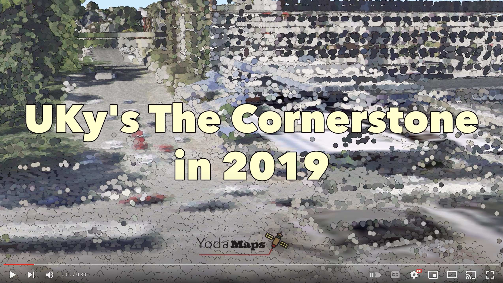

# Esports Theater on University of Kentucky's campus

The Esports Theater is located in The Cornerstone Building on the University of Kentucky's campus at the intersection of Limestone and Avenue of Champions. 

     
*View from The Cornerstone toward the center of campus*

The Cornerstone opened in 2021. Before this date, the corner was occupied by the Kennedy's Bookstore (renamed Kennedy’s Wildcat Den in 2013) since the 1950s. The building was demolished in late 2019.

    
*Bird's eye view of corner*

Play video: [youtu.be/f7C0meQlSTY](https://youtu.be/f7C0meQlSTY)

The data used for these views were acquired in mid 2018 to early 2019, before demolition began. Generated in ArcGIS Pro using [KyFromAbove](https://kyfromabove.ky.gov/) point cloud data, Phase 2 lidar, 2019. Point cloud was colorized using NAIP aerial imagery, 2018, hosted by the Kentucky Division Geographic Information at [kyraster.ky.gov](https://kyraster.ky.gov/arcgis/rest/services/ImageServices) image services.
